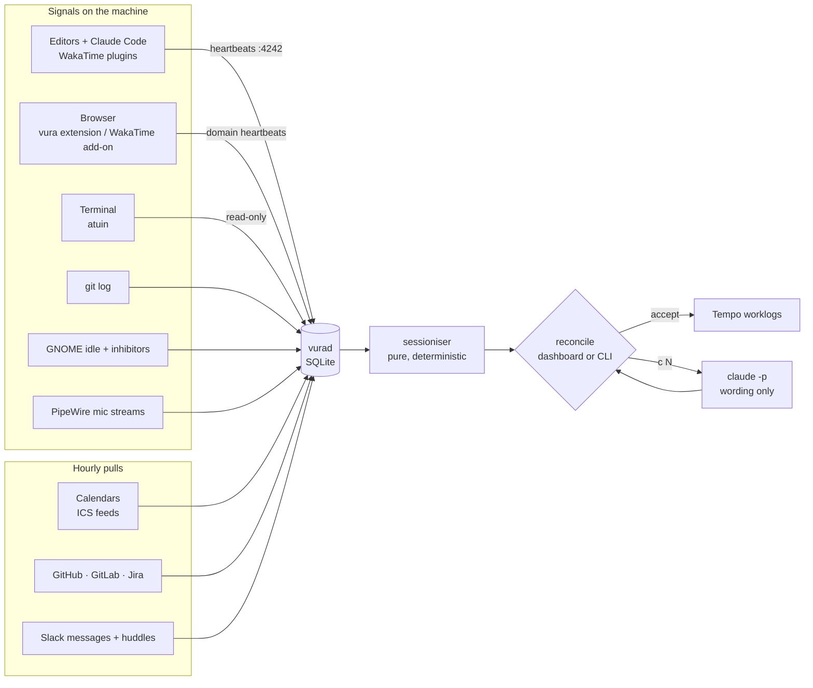

  

<h1 align="center">vura</h1>

<em>The word <strong>vura</strong> is a dialect term that in Kajkavian (and partly in Chakavian) means a clock: the device that measures time, or the unit of sixty minutes.</em>

A daemon that measures where your working day actually went, and a screen where you agree the worklogs before they reach Tempo.

---

vura is for a developer who bills several clients from one machine. It watches
the signals that already exist (editor heartbeats, the terminal, git, the
microphone, calendars, browser domains, code review and ticket activity, Slack)
and turns them into sessions per client, deterministically. Nothing is
inferred toward a target; every hour on the screen points at the evidence
behind it. You review a day in a minute, fix what the evidence got wrong, and
push. Descriptions are the only place a language model is allowed, and only
when you ask.

- **Go measures and computes; Claude only writes prose.** Hours are arithmetic
  over stored rows with a test for every rule.
- **Nothing leaves the machine** except the worklogs you accept and the API
  pulls you configure. Command arguments, message text and page titles are
  never stored.
- **Overlap is allowed.** A call about one client during another's migration is
  two clients in the same minute, and both are real.
- **Rounding is visible.** Every day shows observed next to logged, so a
  rounding gain of an hour is noticed before you press enter.

## Try it in a minute

    make build && ./bin/vura demo

That builds a config and a database with one synthetic day in `/tmp/vura-demo`,
then prints the environment variables to point `vura` at it. Your own config
and data are untouched.

## How it flows

One rule set, the **buckets** in `config.toml`, maps every signal to the Tempo
issue that receives the hours: repo paths, ticket prefixes, browser domains,
meeting titles and attendees, Slack channels. A rule added today re-attributes
past days on the next view.

## Install

Requirements: Linux with systemd user services, Go 1.25 to build, and for the
collectors below whatever each one needs. Tested on Fedora 43 with GNOME on
Wayland.

    git clone https://github.com/valicm/vura && cd vura
    make install          # builds, installs to ~/.local/bin, enables vurad.service and the timers
    vura check            # once tokens are stored: verifies Jira/Tempo and every bucket issue

`make install` copies `config.example.toml` to `~/.config/vura/config.toml` on
first run. Edit `[identity]` and the `[buckets.*]` blocks; everything else has
defaults. `make uninstall` removes it all.

Tokens never go in the config. Store them in the GNOME keyring, or set
`VURA_<NAME>_TOKEN` in the service environment:

    secret-tool store --label='vura tempo'  service vura key tempo
    secret-tool store --label='vura jira'   service vura key jira
    secret-tool store --label='vura github' service vura key github
    secret-tool store --label='vura gitlab' service vura key gitlab
    secret-tool store --label='vura slack'  service vura key slack:<workspace>

## Setting up each source

Every source is optional. A missing token or program skips that source with
one warning in the journal and the rest keep collecting.

### Editors and Claude Code (WakaTime plugins)

Write `~/.wakatime.cfg` **before** installing any plugin; heartbeats sent to
wakatime.com cannot be recalled:

    [settings]
    api_url = http://127.0.0.1:4242/api
    api_key = <any v4 UUID, e.g. from uuidgen>

The `[settings]` header and a UUID-shaped key are required or wakatime-cli
silently does nothing. Then install the WakaTime plugin in each JetBrains IDE
(Settings → Plugins → Marketplace) and, for Claude Code,
`claude plugin install claude-code-wakatime@wakatime`. Set `wakatime_key` in
vura's config to the same key to require it. Heartbeats that arrive while the
daemon is down are queued by wakatime-cli and replayed.

### Browser

Only the focused tab's domain is reported, once a minute, to localhost.

- **Chrome / Chromium:** load the `browser/` directory unpacked at
  `chrome://extensions` with Developer mode on. If `wakatime_key` is set, paste
  the key on the extension's options page. The WakaTime store extension cannot
  be pointed at localhost on Chrome; do not use it.
- **Firefox:** the WakaTime add-on works. In its options set the API URL to
  `http://127.0.0.1:4242/api/v1`, paste the key, save, and accept the
  permission prompt.

Domains count as evidence only when a bucket's `domains` rule claims them.
`vura domains` and the dashboard list the busiest unclaimed ones.

### Terminal (atuin)

Install [atuin](https://atuin.sh) and add its shell hook. On **bash** it also
needs [bash-preexec](https://github.com/rcaloras/bash-preexec) sourced before
`atuin init`, or nothing is recorded:

    [[ -f ~/.bash-preexec.sh ]] && source ~/.bash-preexec.sh
    eval "$(atuin init bash)"

vura reads atuin's database read-only and keeps the working directory, the
binary name and a subcommand for known wrappers. Arguments are dropped before
they reach the store; `shell_denylist` turns password managers into
`[redacted]`.

### Git

List each repo under the bucket it belongs to and your author emails under
`[identity]`. Commits are scanned hourly across all branches; the ticket key
is taken from the branch name first, then the subject. Commits are identity
and moments, never duration.

### Presence and calls (GNOME + PipeWire)

Nothing to install. Idle time comes from mutter's IdleMonitor over D-Bus,
inhibitors (Caffeine, a browser playing audio) from gnome-session, and calls
from applications holding a microphone capture stream in PipeWire. Window
focus is never read.

### Calendars

Any iCalendar URL works, one `[[calendar.feeds]]` block per calendar:

- **Proton:** calendar settings → Share → "Share with anyone" → copy the link.
- **Google Workspace:** Settings → the calendar → Integrate calendar → "Secret
  address in iCal format". If the field is missing, the workspace admin has
  disabled external sharing.

A meeting counts only when a call overlapped it or you were present during it,
and only if a bucket claims it by title or attendee substring, or the feed
carries a default `bucket`. Keep secret URLs out of version control.

### GitHub, GitLab, Jira

Set `github` (your login), `gitlab` (base URL) and one `[[anchors.jira]]` per
site under `[anchors]`. Tokens: a GitHub classic token with `repo`, a GitLab
token with `read_api`, an Atlassian API token from id.atlassian.com (one per
account, valid on every site that account can see; store a `jira:<site>` key
only for a different account). A source behind a VPN can be dark for days; it
catches up from its last successful fetch when it returns.

### Slack

Create an app in the workspace at api.slack.com/apps, add **User Token
Scopes** `search:read` (messages) plus `channels:read`, `groups:read`,
`im:read`, `mpim:read` and the four `*:history` scopes (huddles) and
`users:read` (DM names), install it, and store the User OAuth Token as
`slack:<name>`. Only channel names and timestamps are kept; message text never
reaches the store. Rules match `workspace#channel`; `work#` claims a whole
workspace.

### Tempo and Jira

`identity.jira_site` is where worklogs go. Each bucket's `issue` must exist
there; `vura check` resolves them all. Tempo needs numeric issue ids and your
account id; both are fetched once and cached. Mind Tempo's daily hour limit
(Tempo settings): a rejected worklog stays retryable on the dashboard.

## Daily use

The nag timer notifies at 10:00 (and 19:00 if still pending) while days are
waiting. Open the dashboard, or `vura reconcile` in a terminal:

    vura open                # dashboard as an app window; also a launcher in GNOME
    vura status              # observed hours per bucket per working day
    vura day yesterday       # one day as sessions with evidence
    vura reconcile           # walk pending days, accept pushes to Tempo
    vura reconcile DATE --amend   # redo a pushed day (deletes its Tempo worklogs first)
    vura push [DATE]         # retry failed worklogs
    vura note AUC 1h "call"  # work nothing observed
    vura report --month 2026-09 --html sep.html
    vura backup              # also nightly at 03:30 by timer

The dashboard at http://127.0.0.1:4242/ shows the week per bucket, one day as
a timeline with sessions and evidence, unmapped cues and collector health, and
carries the whole reconcile: assign, edit time and wording, merge selected rows,
drop, notes, Claude wording, dry run, accept, skip, amend, and per-worklog
retry. Writes require a same-origin request with a custom header. A top-bar
indicator (GNOME with the AppIndicator extension) shows today's totals and the
queue.

## How the hours are decided

- Evidence of one bucket closer than `idle_gap` (30m) joins one session.
- Between two pieces of evidence with nothing in between, keyboard idle past
  `away_after` (10m) ends the session when input stopped. Claude Code
  heartbeats, an open mic and a meeting are exempt; Claude heartbeats during
  idle past `idle_gap` flag the session *remote*.
- Outside `active_window` (08:00–01:00), evidence while idle is dropped.
- Sessions made only of moments (commits, anchors) show as "moments only" with
  zero time until you give them some.
- Below `detect_min` (5m) is dropped; the rest round up to `round_min` (15m)
  only when logged, with observed kept alongside.
- Presence with no evidence is *unattributed*; an unmapped project, domain,
  channel or meeting is a cue for one more rule.

## Layout

    cmd/vurad                   the daemon: collectors, WakaTime endpoint, dashboard, tray
    cmd/vura                    the CLI
    internal/collect/*          one package per signal
    internal/bucket             the attribution rules
    internal/session            evidence → sessions; pure, deterministic, tested
    internal/reconcile          sessions → editable worklog entries; replayable edit log
    internal/push               the one write path to Tempo (CLI and dashboard)
    internal/web                dashboard endpoints + embedded page
    internal/tray               top-bar indicator
    browser/                    Chrome extension
    systemd/                    service, timers, desktop entry
    assets/                     logo

## License

MIT. See `LICENSE`.
